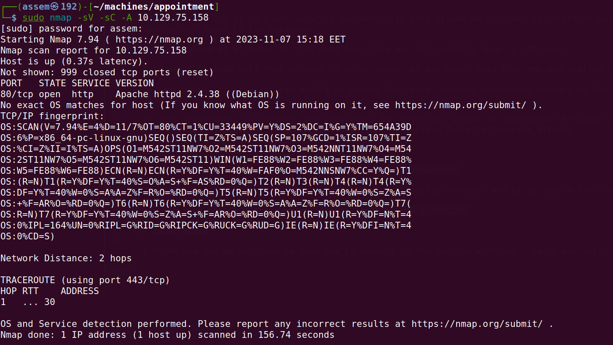
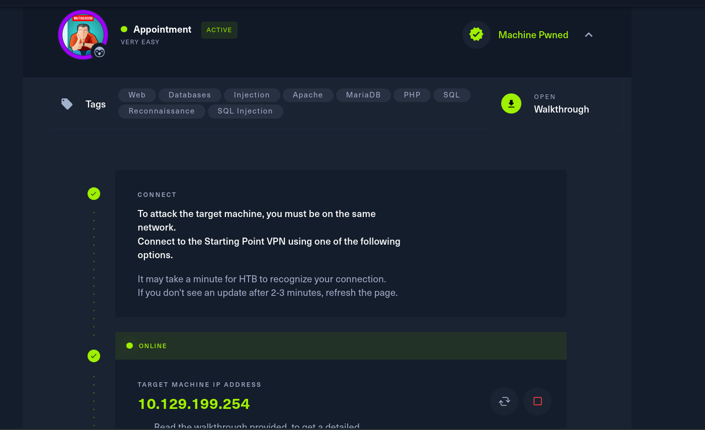
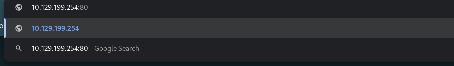
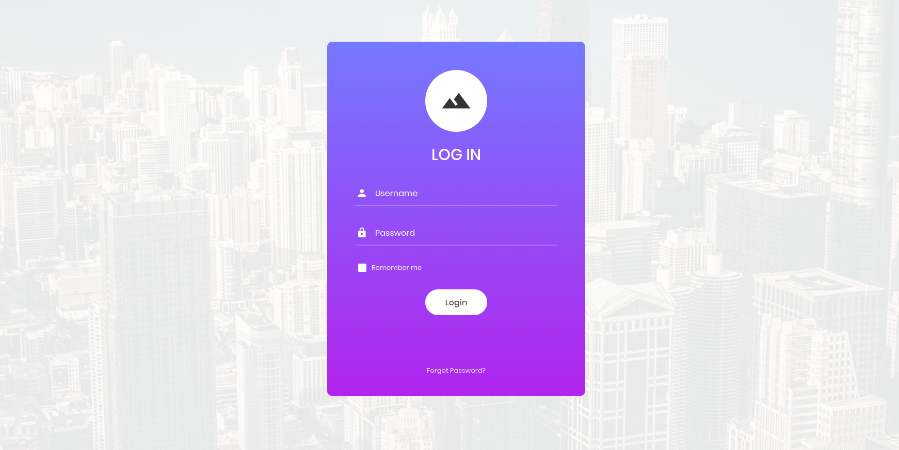
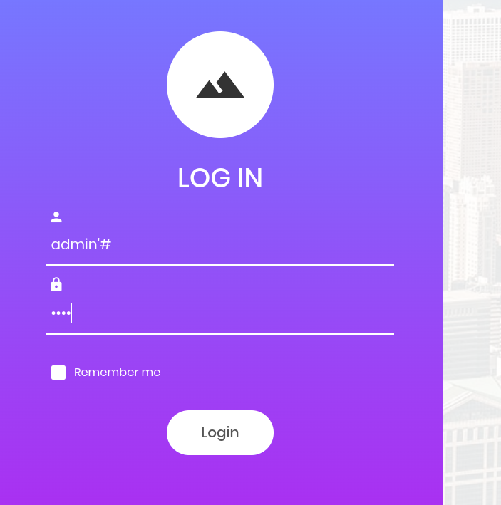
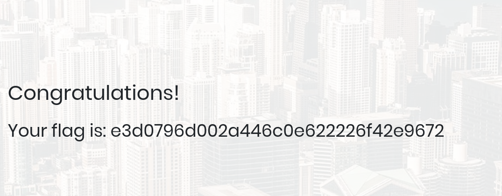

# Appointment_Machine  - Basics of penetration testing - HTB

**In our journy to learn penetration testing basics we will take a machines in HTB to can explain the basics of penetration** 

## Every machine has a basic idea to deliver to you

- in this machine you should be familiar with basics of SQL injection .

- what is SQL ?  
  
  - SQL refer to (Structured query language) is a standard language for database creation and manipulation .


- SQL injection (SQLi) is a web security vulnerability that allows an attacker to interfere with the queries that an 
  application makes to its database. 

- This can allow an attacker to view data that they are not normally able to retrieve.

- This might include data that belongs to other users, or any other data that the application can access.

- In many cases, an attacker can modify or delete this data, causing persistent changes to the application's content or 
  behavior.

- In some situations, an attacker can escalate a SQL injection attack to compromise the underlying server or other 
  back-end infrastructure. It can also enable them to perform denial-of-service attacks.

### ADDITIONAL SOURCES 

- As a penetester you should now some websites like `portswigger`  .

- this website is the best one who explained the sql injection attacks and it is also a free source .

- her the link `https://portswigger.net/web-security/sql-injection` .

- do not continue in this writeup if you didn't need to go to portswigger , go to portswigger and take your time then you should come back .


### Enumeration 

- I think now you do not need to know how to connect to the machine with vbn , do it and let's begin with nmap report .

- i will use this command in terminal `sudo nmap -sV -sC -A {IP_Address}` .




- As you can see in the previous image there is one open port .

- port `80/tcp`  : service run on the open port called `http` and the current version is `apache httpd 2.4.3((debian))` .

- the nmap command I used was so powerful it bring the open ports and running service and the current version . 

- now because we found the port 80 open we gonna type the ip of this machine and open the website and try to find 
  weakness of it. 

- you always will have the ip from the HTB website  lika as following .



- Now , let's try to open the target website in the google .



 - type the ip address and the open port after it like you see in the previous image .


 

- you should got website the same as mine in the previous image .

- now you should now what is the sql-injection , and if you don't back again to portswigger and study the case and 
  comeback .

- we will try to make a simple sql-injection attack by use the default credentials such as :

	    -  admin:admin
		-  guest:guest
		-  user:user
	   	-  root:root
		-  administrator:password


```php
<?php
mysql_connect("localhost", "db_username", "db_password"); # Connection to the SQL
Database.
mysql_select_db("users"); # Database table where user information is stored.
$username=$_POST['username']; # User-specified username.
$password=$_POST['password']; #User-specified password.
$sql="SELECT * FROM users WHERE username='$username' AND password='$password'";
# Query for user/pass retrieval from the DB.
$result=mysql_query($sql);
# Performs query stored in $sql and stores it in $result.
$count=mysql_num_rows($result);
# Sets the $count variable to the number of rows stored in $result.
if ($count==1){
# Checks if there's at least 1 result, and if yes:
$_SESSION['username'] = $username; # Creates a session with the specified $username.
$_SESSION['password'] = $password; # Creates a session with the specified $password.
header("location:home.php"); # Redirect to homepage.
}
else { # If there's no singular result of a user/pass combination:
 header("location:login.php");
 # No redirection, as the login failed in the case the $count variable is not equal to
1, HTTP Response code 200 OK.
}
?>
```
- Notice how after the # symbol, everything turns into a comment? This is how the PHP language works.
  
  - and this will be the vulnerability for this website .

  - if we can type the user name only without password we can get in the websit .

  - we can do this if the php code have a `#` before the password , the question here how we can modify in php code .

  - you don't need to open the php code you just need to type `'#` after the user_name in login page .

  - when the website send the input to database this will make any characters after user_name comment and this will make you do not need to need the password for the user just type it any thing and type enter .


- type user_name as `admin'#` , and type any password like `abc` .
 

- And her you got your flag .



***Congratulations , Assem_Ayman_44***